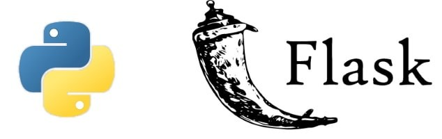

# Flash-cards App

A web-based flashcards application that allows users to upload and study flashcards from CSV files.

## Description

This project is a Flask-based web application that demonstrates:

- **CSV Upload**: Easy import of flashcards via CSV files
- **Interactive UI**: Flip cards, navigate through sets
- **Keyboard Navigation**: Use arrow keys for efficient studying
- **Modern Design**: Clean and responsive interface
- **Set Management**: Create and delete flashcard sets

## Features

- **CSV Import**: Upload your flashcard sets in CSV format
- **Interactive Cards**: Click or use keyboard to flip cards
- **Keyboard Shortcuts**:
  - ↑/↓: Flip card
  - ←/→: Navigate between cards
- **Progress Tracking**: See your position in the deck
- **Set Management**: Delete sets you no longer need
- **Mobile Responsive**: Study on any device

## Requirements

- Python 3.11+
- Flask
- Modern web browser

## Installation

1. Clone the repository:

```bash
git clone https://github.com/wallaceespindola/flashcards-app.git
cd flashcards-app
```

2. Create a virtual environment:

```bash
python -m venv .venv
source .venv/bin/activate  # On Windows: .venv\Scripts\activate
```

3. Install dependencies:

```bash
pip install -r requirements.txt
```

## Running the Application

Start the application with:

```bash
python app.py
```

Open your browser at http://localhost:5000 to start using the flashcards app.

## CSV Format

Your CSV textual files should follow this format (question/answer delimiter is ;):

```csv
question;answer
What is the capital of France?;Paris
What is the capital of Brazil?;Brasília
What is 2+2?;4
```

You can also include a header row with "Question" and "Answer" (case insensitive).

The name of the uploaded file will be used as the name of the flashcard set.

CSV example with questions about Belgium:

```csv
question;answer
What is the capital of Belgium?;Brussels
What are the three official languages of Belgium?;Dutch, French, and German
Which famous statue is a symbol of Brussels?;Manneken Pis
Which organization has its headquarters in Brussels?;European Union
What is Belgium famous for in cuisine?;Chocolate, waffles, and beer
Which two main regions make up Belgium?;Flanders and Wallonia
What is Belgium's national day?;July 21
```

As simple as that ;)

## Some screenshots

The home:


The study cards:


You finished cards:


Give it a try on:

- **Flashcards App - PythonAnywhere**: [wallacese.pythonanywhere.com](https://wallacese.pythonanywhere.com/)

## Author Information

- Wallace Espindola, Sr. Software Engineer / Java & Python Dev
- **LinkedIn:** [linkedin.com/in/wallaceespindola/](https://www.linkedin.com/in/wallaceespindola/)
- **GitHub:** [github.com/wallaceespindola](https://github.com/wallaceespindola)
- **E-mail:** [wallace.espindola@gmail.com](mailto:wallace.espindola@gmail.com)
- **Twitter:** [@wsespindola](https://twitter.com/wsespindola)
- **Gravatar:** [gravatar.com/wallacese](https://gravatar.com/wallacese)
- **Dev Community:** [dev.to/wallaceespindola](https://dev.to/wallaceespindola)
- **DZone Articles:** [DZone Profile](https://dzone.com/users/1254611/wallacese.html)
- **Pulse Articles:** [LinkedIn Articles](https://www.linkedin.com/in/wallaceespindola/recent-activity/articles/)
- **Website:** [W-Tech IT Solutions](https://www.wtechitsolutions.com/)
- **Presentation Slides:** [Speakerdeck](https://speakerdeck.com/wallacese)

## License

- This project is released under the Apache 2.0 License.
- See the [LICENSE](LICENSE) file for details.
- Copyright © 2025 [Wallace Espindola](https://github.com/wallaceespindola/).
