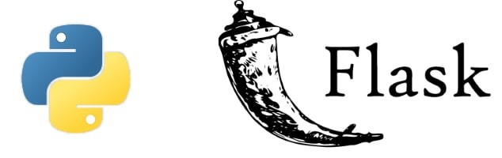
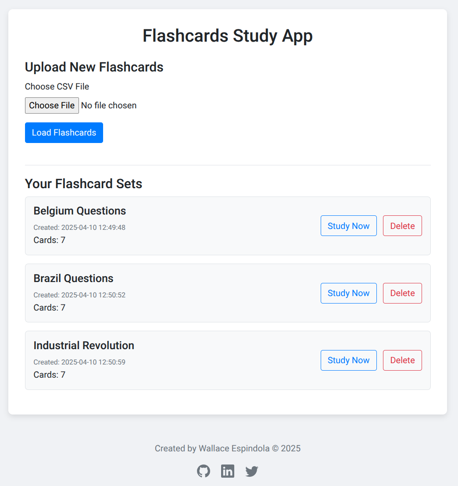
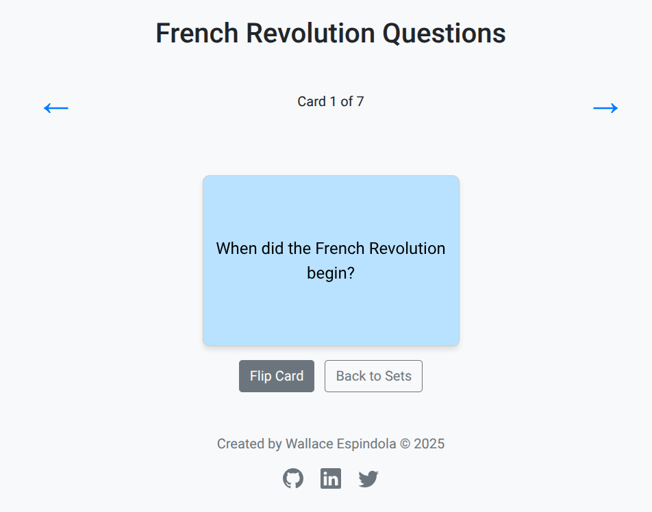
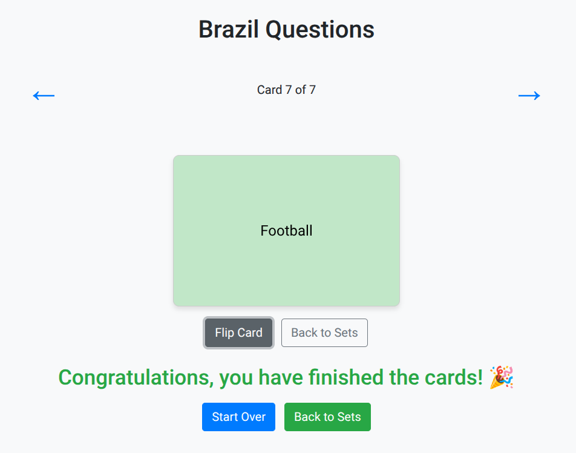

# Flash-cards App


[](https://github.com/wallaceespindola/flashcards-app/actions/workflows/ci.yml)

A web-based flashcards application that allows users to upload and study flashcards from CSV files.
Upload a semicolon-separated question/answer file, then flip through the cards with the mouse, touch or arrow keys.

Live demo: [wallacese.pythonanywhere.com](https://wallacese.pythonanywhere.com/)

## Table of Contents

- [Features](#features)
- [Tech Stack](#tech-stack)
- [Prerequisites](#prerequisites)
- [Quick Start](#quick-start)
- [Usage](#usage)
- [CSV Format](#csv-format)
- [Screenshots](#screenshots)
- [Running Tests](#running-tests)
- [Project Structure](#project-structure)
- [Author Information](#author-information)
- [License](#license)

## Features

- **CSV Import**: Upload your flashcard sets in CSV format; the file name becomes the set title
  (`french_revolution_questions.csv` is shown as "French Revolution Questions")
- **Interactive Cards**: Click the card, press **Flip Card**, or use the keyboard to flip
- **Keyboard Shortcuts**:
  - ↑/↓: Flip card
  - ←/→: Navigate between cards
- **Progress Tracking**: A "Card N of M" counter, plus a completion message with **Start Over** at the end of the deck
- **Set Management**: Uploaded sets are listed on the home page, where you can reopen or delete them
- **Mobile Responsive**: Study on any device

> Sets are held in memory only. They are lost when the server restarts.

## Tech Stack

| Layer     | Technology                                         |
|-----------|----------------------------------------------------|
| Language  | Python 3.11+ (`.python-version` pins 3.11; CI runs 3.12) |
| Framework | Flask 3.1.0                                        |
| Templates | Jinja2 (`templates/`)                              |
| UI        | Bootstrap 4.5 (CDN) + vanilla JavaScript           |
| CI        | GitHub Actions (install + smoke test)              |

## Prerequisites

- Python 3.11+
- pip
- A modern web browser

## Quick Start

1. Clone the repository:

```bash
git clone https://github.com/wallaceespindola/flashcards-app.git
cd flashcards-app
```

2. Create a virtual environment:

```bash
python -m venv .venv
source .venv/bin/activate  # On Windows: .venv\Scripts\activate
```

3. Install dependencies:

```bash
pip install -r requirements.txt
```

4. Start the application (Flask debug server on port 5000):

```bash
python app.py
```

Open your browser at http://localhost:5000 to start using the flashcards app.

## Usage

1. On the home page, choose a `.csv` file and upload it. The first card opens right away.
2. Flip and navigate with the buttons or the arrow keys.
3. Go **Back to Sets** to reopen or delete any set uploaded during this session.

Ready-made sample decks live in [`resources/`](resources/):

| File                                                                                         | Topic                 |
|----------------------------------------------------------------------------------------------|-----------------------|
| [`belgium_questions.csv`](resources/belgium_questions.csv)                                   | Belgium               |
| [`brazil_questions.csv`](resources/brazil_questions.csv)                                     | Brazil                |
| [`french_revolution_questions.csv`](resources/french_revolution_questions.csv)               | French Revolution     |
| [`industrial_revolution_questions.csv`](resources/industrial_revolution_questions.csv)       | Industrial Revolution |

Routes served by [`app.py`](app.py):

| Method   | Path               | Purpose                                      |
|----------|--------------------|----------------------------------------------|
| GET      | `/`                | Upload form and list of saved sets           |
| POST     | `/`                | Upload a CSV (`csv_file` form field) and start studying |
| GET      | `/set/<set_id>`    | Study a saved set                            |
| POST     | `/delete/<set_id>` | Delete a saved set                           |

## CSV Format

Your CSV textual files should follow this format (question/answer delimiter is ;):

```csv
question;answer
What is the capital of France?;Paris
What is the capital of Brazil?;Brasília
What is 2+2?;4
```

The header row is optional. If the first cell is `question` or `q` (case insensitive), the row is skipped;
otherwise it is read as the first card. Rows with fewer than two columns are ignored. Files must be UTF-8.

The name of the uploaded file will be used as the name of the flashcard set.

CSV example with questions about Belgium:

```csv
question;answer
What is the capital of Belgium?;Brussels
What are the three official languages of Belgium?;Dutch, French, and German
Which famous statue is a symbol of Brussels?;Manneken Pis
Which organization has its headquarters in Brussels?;European Union
What is Belgium famous for in cuisine?;Chocolate, waffles, and beer
Which two main regions make up Belgium?;Flanders and Wallonia
What is Belgium's national day?;July 21
```

As simple as that ;)

## Screenshots

The home:



The study cards:



You finished cards:



## Running Tests

There is no test suite yet. The [CI workflow](.github/workflows/ci.yml) runs on every push and pull request to `main`:
it installs `requirements.txt`, byte-compiles `app.py` and `main.py`, and runs a smoke test asserting the home page
returns HTTP 200. You can run the same check locally:

```bash
python -c "import app; assert app.app.test_client().get('/').status_code == 200"
```

## Project Structure

```text
flashcards-app/
├── app.py                  # Flask app: routes, CSV parsing, in-memory set store
├── main.py                 # Placeholder entry point (prints a greeting; not the web app)
├── templates/
│   ├── index.html          # Upload form + saved sets
│   └── flashcards.html     # Study view (flip, navigate, progress)
├── resources/              # Sample CSV decks, screenshots, logo
├── requirements.txt        # Runtime dependencies (Flask)
├── pyproject.toml          # Project metadata and tool config
└── .github/workflows/ci.yml
```

## Author Information

- Wallace Espindola, Sr. Software Engineer / Java & Python Dev
- **LinkedIn:** [linkedin.com/in/wallaceespindola/](https://www.linkedin.com/in/wallaceespindola/)
- **GitHub:** [github.com/wallaceespindola](https://github.com/wallaceespindola)
- **E-mail:** [wallace.espindola@gmail.com](mailto:wallace.espindola@gmail.com)
- **Twitter:** [@wsespindola](https://twitter.com/wsespindola)
- **Gravatar:** [gravatar.com/wallacese](https://gravatar.com/wallacese)
- **Dev Community:** [dev.to/wallaceespindola](https://dev.to/wallaceespindola)
- **DZone Articles:** [DZone Profile](https://dzone.com/users/1254611/wallacese.html)
- **Pulse Articles:** [LinkedIn Articles](https://www.linkedin.com/in/wallaceespindola/recent-activity/articles/)
- **Website:** [W-Tech IT Solutions](https://www.wtechitsolutions.com/)
- **Presentation Slides:** [Speakerdeck](https://speakerdeck.com/wallacese)

## License

- This project is released under the Apache 2.0 License.
- See the [LICENSE](LICENSE) file for details.
- Copyright © 2025 [Wallace Espindola](https://github.com/wallaceespindola/).
